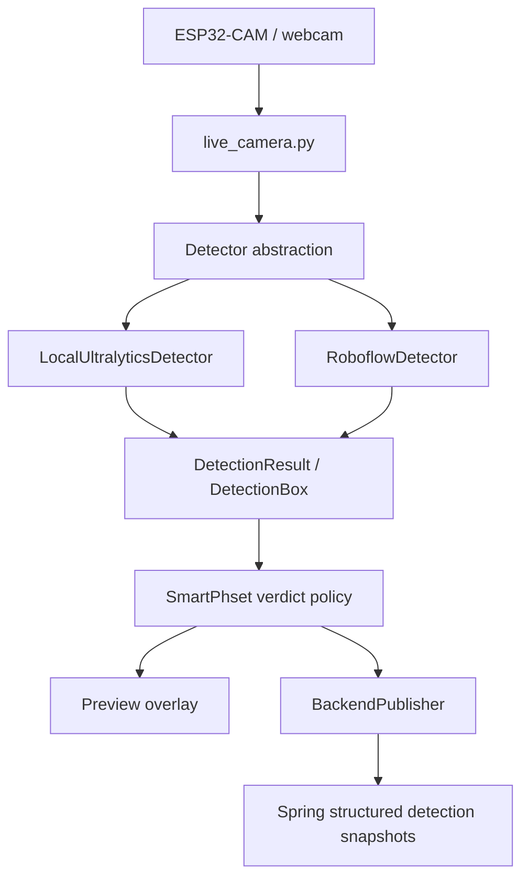

# Mushroom detector integration

## Architecture

Camera frames are read in the AI process. Local inference stays on that machine;
hosted inference sends selected in-memory frames to Roboflow. Neither path sends
video or images to Spring. Both providers return labels, unrounded confidence and
original-frame pixel `xyxy` coordinates through the same contracts. Live camera
and evaluation reuse the same detector factory and verdict function.

## Model source and attribution

Hosted model ID: **contamination-detection-ozkwx/1**. Task: object detection.
Known classes: **Healthy**, **Contaminated**. Source: **Contamination Detection**
by **Oyster Mushroom Fruiting Bag**, published on
[Roboflow Universe](https://universe.roboflow.com/oyster-mushroom-fruiting-bag/contamination-detection-ozkwx).
The project page lists [CC BY 4.0](https://creativecommons.org/licenses/by/4.0/).
Preserve this attribution when sharing source-derived materials. SmartPhset
normalizes provider output; it has not retrained or modified the hosted model.
The local artifact remains `models/best.pt`; see its separate
[model card](model-card.md) and historical public-data evidence. Do not equate the
local artifact's history with validation of the hosted model.

Source/API facts rechecked 2026-10-08. Universe-published metrics describe that
project's evaluation split, **not SmartPhset real-world validation**. No
representative grow-room dataset/results currently exist here, and no production
quality claim is made. Historical public-data evidence is not a new local
farm evaluation.

## Actual SDK implementation

Default endpoint: `https://serverless.roboflow.com`. Defaults can be overridden
with the actual `--roboflow-model-id` and `--roboflow-api-url` options.
[Official model example](https://universe.roboflow.com/oyster-mushroom-fruiting-bag/contamination-detection-ozkwx)
shows this endpoint/model ID and header authentication.

Installed [inference-sdk 1.7.3](https://pypi.org/project/inference-sdk/1.7.3/)
supports Python >=3.10,<3.14; this project validates Python 3.11. The provider
constructs one InferenceHTTPClient and configures `api_key_transport="header"`,
`confidence_threshold` from `--conf`, and `client_downsizing_disabled=True`.
The SDK handles in-memory BGR NumPy input and encoding; no temporary image files
or application JPEG encoding are used. Center-based hosted boxes become float
`xyxy` coordinates. Invalid predictions reject the whole inspection so a bad
contamination box cannot be dropped to create GREEN.

SDK 1.7.3 has no supported request-timeout constructor/configuration field.
The synchronous Detector method runs official `infer_async(frame, model_id=...)`
under `asyncio.wait_for` with an eight-second deadline in the sole inference
worker. SDK network contexts close on cancellation. One detect invokes the SDK
once; SDK internal retries can mean multiple HTTP attempts. Local synchronous
encoding cannot be interrupted by that deadline. Installed SDK transport/auth,
NumPy handling and cancellation are covered with mocked outbound transport.

ROBOFLOW_API_KEY comes from the environment in normal CLI use. Header auth avoids
putting the key in the request URL. Provider errors suppress raw SDK exception
text. Hosted usage may be billable; check your account's current
[pricing](https://roboflow.com/pricing), quota and model access before an intentional
manual run. No exact account-specific rate or access guarantee is asserted.

Local Ultralytics 8.4.71 loads the specified weights once, predicting with
confidence, image size (416 default), optional device and verbose=False. It
preserves full returned confidence and original-frame coordinates. Current
[Ultralytics prediction docs](https://docs.ultralytics.com/modes/predict/)
explain those inputs/outputs; this integration deliberately keeps the existing
installed version rather than upgrading to match newer documentation examples.

## Verdict and evaluation acceptance

The contamination-first live policy and exact messages are documented in
[live camera](live-camera.md#scheduling-verdicts-and-failures). Default input
confidence is 0.4; fixed severity thresholds remain 0.4/0.8. These are existing
product rules, not newly calibrated thresholds. Hosted unavailability and expired
results are GREY and never trigger local fallback.

[Evaluation guide](evaluation.md) defines healthy/contaminated/negative image
scoring, CSV and latency metrics. GREY low-confidence contamination is a separately
visible miss for contaminated examples. Missing/unreadable/unavailable inspections
are excluded from accuracy and must be reviewed separately. Accuracy alone is
insufficient; inspect misses, false alerts, negative-scene claims, class balance,
availability and latency before choosing a deployment provider.

Evaluation status as of 2026-10-08: **no real SmartPhset dataset evaluated**.
Automated synthetic fixtures test tool behavior only. Collect independently labeled,
representative held-out grow-room images and run both providers with recorded
configuration. The default remains local until an explicit deployment decision;
this integration does not automatically promote the hosted candidate.

See [setup, commands and manual checklist](live-camera.md) for environment setup,
ESP32/webcam, backend publishing, secrets and failure recovery.
